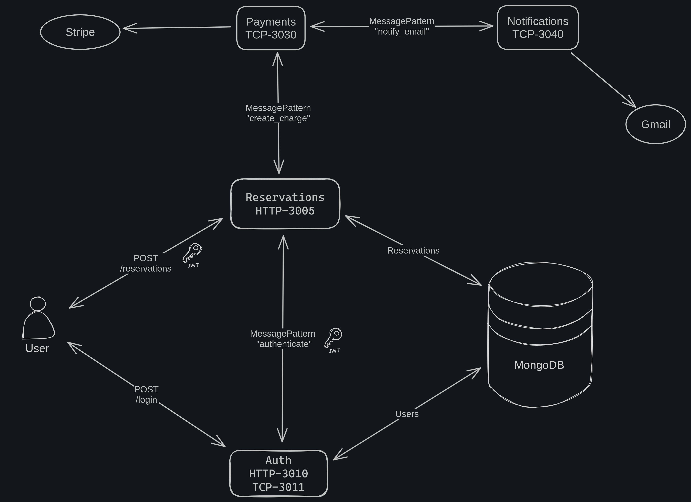
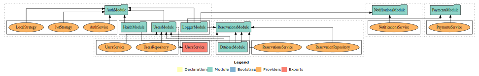

# PAYMENT APP

## Basic System Design


#### Modules


## Required
Node version > v18.19.1
Docker version 26.1.1
Docker Compose version v2.3.3

## Start
Run:
```
docker compose up -d --build
```

## Test E2E
Run
```
pnpm run test:e2e
```

## Repository Activity

